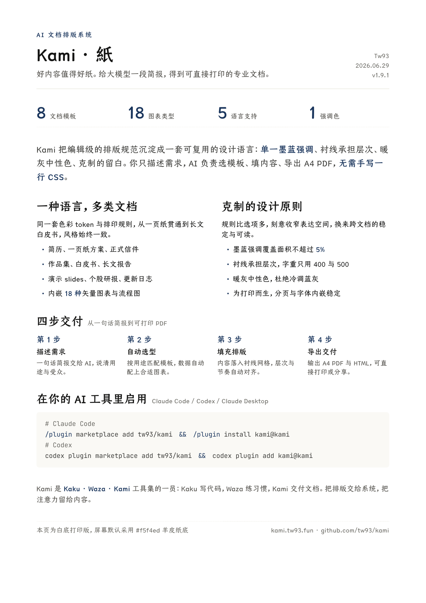

<div align="center">
  
  <h1>Kami</h1>
  <p><b>よい内容には、よい版面を</b></p>
  <p><a href="README.md">English</a> · <a href="README_CN.md">中文</a> · <a href="README_TW.md">繁體</a> · 日本語 · <a href="README_KR.md">한국어</a> · <a href="README_DE.md">Deutsch</a> · <a href="README_FR.md">Français</a></p>
  <a href="https://github.com/tw93/kami/stargazers"></a>
  <a href="https://github.com/tw93/kami/releases"></a>
  <a href="LICENSE"></a>
  <a href="https://twitter.com/HiTw93"></a>
</div>

## 概要

Kami は、AI Agent に文書とランディングページのテンプレートと組版ルールを提供します。PDF と PNG を出力でき、スライドは編集可能な PowerPoint としても書き出せます。

Kami（紙、かみ）は日本語の「紙」に由来します。8 種類の文書テンプレート、ランディングページシステム、内容とレイアウトのチェックを備えています。

三部作のひとつ：[Kaku](https://github.com/tw93/Kaku)（書く）がコードを書き、[Waza](https://github.com/tw93/Waza)（技）がエンジニア習慣を鍛え、[Kami](https://github.com/tw93/Kami)（紙）がドキュメントを納品します。

## 出力サンプル

多様な形式と多言語の実物 PDF サンプルです。カードをクリックするとファイルを確認できます。

<table>
<tr>
  <td align="center" width="25%">
    <a href="site/assets/demos/demo-musk-resume.pdf"></a>
    <br><b>履歴書</b> · 英語
    <br><sub>創業者 CV、2 ページ</sub>
  </td>
  <td align="center" width="25%">
    <a href="site/assets/demos/demo-kami-print.pdf"></a>
    <br><b>一枚資料</b> · 中国語
    <br><sub>Kami 紹介、白地印刷版、1 ページ</sub>
  </td>
  <td align="center" width="25%">
    <a href="site/assets/demos/demo-tesla.pdf"></a>
    <br><b>株式レポート</b> · 中国語
    <br><sub>Tesla Q1 2026 決算分析</sub>
  </td>
  <td align="center" width="25%">
    <a href="site/assets/demos/demo-agent-slides.pdf"></a>
    <br><b>スライド</b> · 英語
    <br><sub>登壇用スライド、全 8 ページ</sub>
  </td>
</tr>
<tr>
  <td align="center" width="25%">
    <a href="site/assets/demos/demo-mole.pdf"></a>
    <br><b>一枚資料</b> · 英語
    <br><sub>Mole 製品概要、1 ページ</sub>
  </td>
  <td align="center" width="25%">
    <a href="site/assets/demos/demo-letter.pdf"></a>
    <br><b>書簡</b> · 中国語
    <br><sub>正式な推薦状、1 ページ</sub>
  </td>
  <td align="center" width="25%">
    <a href="site/assets/demos/demo-changelog.pdf"></a>
    <br><b>更新履歴</b> · 英語
    <br><sub>Mole v1.7.1 リリースノート</sub>
  </td>
  <td align="center" width="25%">
    <a href="site/assets/demos/demo-kaku.pdf"></a>
    <br><b>ポートフォリオ</b> · 日本語
    <br><sub>Kaku ターミナル作品集、7 ページ</sub>
  </td>
</tr>
</table>

## インストール

**Claude Code、Codex、Cursor、その他の Agent**

```bash
npx skills add tw93/kami -a claude-code codex cursor -g -y
```

スキルは共有ディレクトリ `~/.agents/skills` に配置されます。Claude Code は自動でシンボリックリンクを作成し、Codex や Cursor など対応 Agent からは `/kami` として認識されます。更新は `npx skills update -g -y` を実行してください。

または Agent に直接指示してインストール：
> https://kami.tw93.fun/llms.txt を読んで Kami をインストールして

**プラグイン形式での利用**（Claude Code v2.1.142 以降、名前空間は `/kami:kami`）：

```bash
# Claude Code（更新：claude plugin update kami）
/plugin marketplace add tw93/kami
/plugin install kami@kami

# Codex（更新：codex plugin marketplace upgrade kami、その後 codex plugin add kami@kami）
codex plugin marketplace add tw93/kami
codex plugin add kami@kami
```

**Claude Desktop**：GitHub Releases から正式配布用の [kami.zip](https://github.com/tw93/kami/releases/latest/download/kami.zip) をダウンロードし、Customize > Skills > "+" > Create skill からアップロードします。GitHub のソース ZIP ではなく、このリリースアセットを使ってください。更新はスキルカードの「...」から Replace を選び、最新の ZIP をアップロードします。

大容量の CJK フォントは配布 ZIP に含まれていません：`skills/kami/scripts/ensure-fonts.sh` が不足フォントを自動検出してローカル環境に準備します。

Kami は一日に一度だけ静かにバージョンを確認し、新しいリリースがあれば会話の中で知らせます。ローカルの XDG キャッシュディレクトリにマーカーを書き込み、GitHub の最新公開リリースを確認しますが、文書や会話の内容は送信しません。オフラインのときやキャッシュディレクトリがないときは何もせずスキップします。

## 使い方

スラッシュコマンドは不要で、自然言語のリクエストから自動で起動します。

### 対応言語

英語と中国語に最も手厚く対応しています。日本語と韓国語は専用フォントフォールバックとレイアウト微調整によりサポートされ、出力前に個別検証が行われます：

| 言語 | サポート度 | 既定の明朝体・セリフ書体 |
| :--- | :--- | :--- |
| **English** | 完全対応 | Charter |
| **中国語**（簡体字 / 繁体字） | 完全対応 | TsangerJinKai02（倉耳今楷） |
| **日本語** | フォント代替と個別検証 | YuMincho（游明朝） |
| **韓国語** | フォント代替と個別検証 | Source Han Serif K（思源宋体 韓文） |

各言語のプロンプト例：

- 日本語: `スタートアップ向けの一枚資料を作って` / `この調査を長文レポートに整えて` / `正式な依頼文を作って` / `プロジェクト作品集を作って` / `履歴書を作って` / `登壇用スライドを作って` / `Marp で登壇スライドを作って` / `アプリのランディングページを作って`
- 中文: `帮我做一份一页纸` / `帮我排版一份长文档` / `帮我写一封正式信件` / `帮我做一份作品集` / `帮我做一份简历` / `帮我做一套演讲幻灯片` / `帮我做一份 Markdown 风格的演示稿` / `帮我做一个产品落地页`
- English: `make a one-pager for my startup` / `turn this research into a long doc` / `write a formal letter` / `make a portfolio of my projects` / `build me a resume` / `design a slide deck for my talk` / `make this talk as a Marp deck` / `build a landing page for my app`
- 한국어: `스타트업 원페이저를 만들어줘` / `이 리서치를 장문 문서로 정리해줘` / `정식 레터를 작성해줘` / `프로젝트 포트폴리오를 만들어줘` / `이력서를 만들어줘` / `발표용 슬라이드를 만들어줘` / `Marp 슬라이드로 만들어줘` / `앱 랜딩 페이지를 만들어줘`

**ブランド設定**（任意）

`~/.config/kami/brand.md` を作成すると、自身のブランド色、デフォルト言語、トーンを固定できます。設定例は [brand.example.md](skills/kami/references/brand.example.md) を参照してください。

## 設計原則

基本の配色は淡い紙色の背景（`#f5f4ed`）、インクブルー（`#1B365D`）のアクセント、そしてセリフ書体です。文字の大きさと余白で見出しと本文を区別します。ブランドに合わせて既定値を調整できます。

- **テンプレート群**：一枚資料、長文レポート、書簡、ポートフォリオ、履歴書、スライド、決算レポート、更新履歴の 8 種とランディングページシステム。いずれも中国語、英語、韓国語の 3 バージョンがあります。
- **図表コンポーネント**：18 種のインライン SVG 図表。Mermaid 記述から [beautiful-mermaid](https://github.com/lukilabs/beautiful-mermaid) と `skills/kami/scripts/mermaid_normalize.py` を通じて Kami 色彩のクリーンなベクター図に変換します。
- **スライド**：WeasyPrint による PDF、python-pptx による編集可能 PPTX、Markdown 優先の Marp 形式に対応。
- **コード表示**：Pygments による構文ハイライトに対応。
- **品質検証**：JSON Schema による入力構造検査、記述抜けを防ぐカバレッジ検査、レンダリング画像の目視確認を実施。
- **ローカル MCP**：`skills/kami/scripts/mcp_server.py` にゼロ依存の MCP サーバーを内蔵。信頼できるローカル HTML だけをレンダリングしてください。参照先のファイルや HTTP、HTTPS のリソースは MCP プロセスの権限で読み込まれます。
- **白地印刷**：プリンター出力に最適な白背景切り替えオプションを用意。

書いた言語に合わせて Kami が対応するバージョンを選びます。

**フォント規約**：一頁につき単一のセリフ書体を使用します。英語：Charter、中国語：倉耳今楷、日本語：游明朝、韓国語：Source Han Serif K。詳細は [ライセンス](#ライセンス) をご覧ください。

詳細仕様：[design.md](skills/kami/references/design.md)、クイックリファレンス：[CHEATSHEET.md](skills/kami/CHEATSHEET.md)。

## ドキュメントの先へ

同じ組版ルールは、製品の公式ウェブサイト制作や画像生成 AI のプロンプト指定にもそのまま適用できます。

<table>
<tr>
  <td align="center" width="25%" valign="top">
    <a href="https://kami.tw93.fun"></a>
    <br><b>Kami</b> · ランディングページ
    <br><sub>デザインシステム公式サイト</sub>
  </td>
  <td align="center" width="25%" valign="top">
    <a href="https://mole.fit"></a>
    <br><b>Mole</b> · ランディングページ
    <br><sub>macOS システムクリーナー</sub>
  </td>
  <td align="center" width="25%" valign="top">
    
    <br><b>構成図再描画</b> · 英語
    <br><sub>SpatialVLA 論文図 1 再構成</sub>
  </td>
  <td align="center" width="25%" valign="top">
    
    <br><b>特許図レイアウト</b> · 中国語
    <br><sub>Tesla Optimus 特許図面一覧</sub>
  </td>
</tr>
</table>

ランディングページは多言語サイトとしてそのままデプロイできます。ホストに画像生成機能があればそれで挿絵を描き、なければ Kami が同じ内容の完全な指示文を出力し、画像モデルで使えるようにします。

```text
Redraw this as a clean editorial diagram. Background: warm parchment (#f5f4ed), never pure white. One accent only, ink blue (#1B365D); everything else in warm gray with a yellow-brown undertone, no other colors. Thin single-line geometric strokes and simple flat icons. No gradients, no drop shadows, no 3D. Labels in a serif typeface. Generous whitespace, calm and composed, like a figure in a well-typeset report.
```

<sub>ChatGPT Images で一度に生成し、手作業の修正はしていません。Kami が指示を書き、描画はレンダラーが担います。</sub>

## 開発の背景

米国株投資が好きで、Claude にリサーチレポートを書かせる場面が多いです。出力はいつも既定のドキュメント風で、灰色で平板、セッションごとにレイアウトが変わる。構成は追いづらく書式は古臭く、読み続ける気になれませんでした。書体、配色、余白をひとつずつ直していき、読んでいて心地よいページに仕上げました。

その後「あなたの知らない Agent：原理、アーキテクチャとエンジニアリング実践」の発表をすることになり、Claude Design で自分のスタイルのまま組版し、何度も調整を繰り返して納得のいく仕上がりにしました。その後、SVG 図表を加え、配色と余白を揃え、普段作る文書にも使うようになり、テンプレートとルールをまとめたものが Kami です。

## サポート

- 有料の Mac クリーナーアプリ [Mole for Mac](https://mole.fit) の購入が、最も直接的な支援になります。
- Kami が役に立った場合は、スターを付けたり、[Twitter で共有](https://twitter.com/intent/tweet?url=https://github.com/tw93/kami&text=Kami%20-%20A%20quiet%20design%20system%20for%20professional%20documents.)したり、Issue や PR をお寄せください。
- 私には「湯円（TangYuan）」と「可楽（Coke）」という二匹の猫がいます。もし Kami を気に入っていただけたら、<a href="https://cats.tw93.fun?name=Kami" target="_blank">缶詰をごちそうしてください 🥩</a>。

<details>
<summary>支援してくださった方々 🐱</summary>
<br/>
<a href="https://cats.tw93.fun?name=Kami"></a>
</details>

## ライセンス

Kami のコードとテンプレートは MIT ライセンスです。

**フォント規約**：TsangerJinKai02 は個人非商用利用のみ無料、商用利用は [tsanger.cn](https://tsanger.cn) のライセンスが必要です。Source Han Serif K は OFL です。Charter と YuMincho は OS 付属のフォントで、Kami には同梱していません。CJK 代替フォントはシステム同梱またはオープンソースです。
